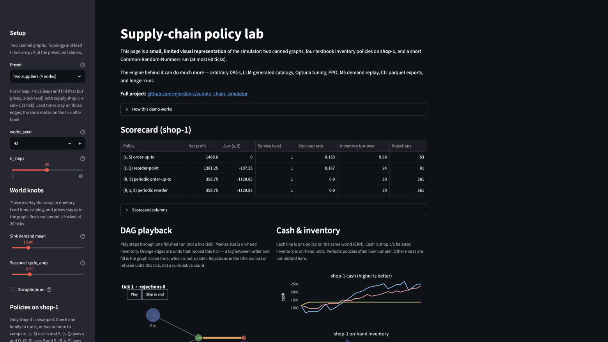
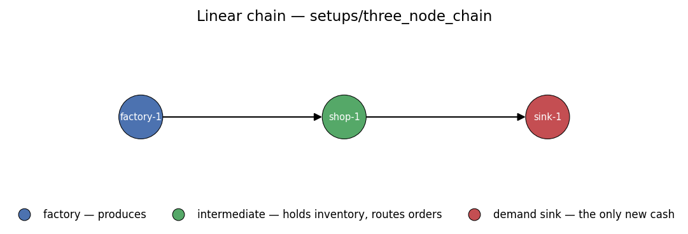
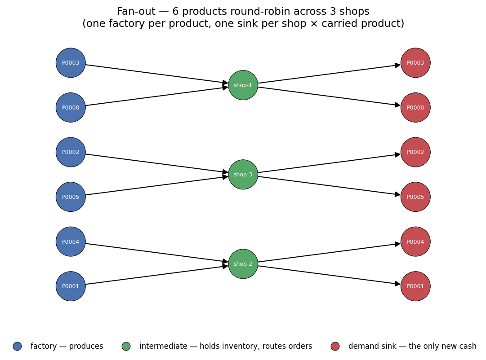

# Supply Chain Simulator

A small, hackable **multi-echelon** supply-chain simulator. A scenario is a validated directed
acyclic graph of typed nodes — factories produce, intermediate nodes (warehouses / shops) hold
inventory and route orders across multiple upstream suppliers, and demand sinks generate the only
new cash in the system — all sharing one stochastic world (regional supply/demand, seasonal cycles,
and disruption events). A live central offer book lets buyers route against real-time supplier
availability; orders settle through a first-come-first-served allocator and arrive after a physical
lead time. Each node runs its own decision policy. Demand can be drawn from stochastic
distributions or replayed from real-world sales data (e.g. the Kaggle M5 / Walmart dataset — see
[`src/sim/README.md`](src/sim/README.md#real-data-demand-replay-m5)).

The simulator ships with a family of textbook inventory policies — `OrderUpToPolicy` (s,S),
`ReorderPointPolicy` (s,Q), `PeriodicOrderUpToPolicy` (R,S), and `PeriodicReorderPolicy` (R,s,S),
all lifted to multi-supplier routing — that serve as ready-made baselines. Four add-ons build on
top: an **LLM world generator** that drafts a realistic catalog and market from a domain prompt,
a **hyperparameter tuner** built on Optuna, a **PPO reinforcement-learning stack** that trains a
continuous-control policy against the textbook baseline using Common Random Numbers (a trained
checkpoint attaches to any intermediate node via `RLNodePolicy`), and an **M5 demand-replay
adapter** that turns Walmart sales into a loadable setup directory.

It is a demo project — the goal is to be readable and easy to extend, not production-grade.

A limited Streamlit visual slice of the engine is live at
[https://supply-chain-simulator-321519234624.europe-west1.run.app](https://supply-chain-simulator-321519234624.europe-west1.run.app)
and documented in [Light web demo](#light-web-demo).


## Quickstart

```bash
uv sync                                               # install
uv run python main.py run setups/three_node_chain     # run the minimal example
uv run pytest                                         # tests
```

Outputs land under `data/three_node_chain/` (parquet + JSON + PNG). Neither runnable example
setup requires an API key.

## Light web demo

[`src/web/`](src/web/) is a **small, limited visual representation** of the simulator:
two canned graphs, four textbook inventory policies on `shop-1`, and a short
Common-Random-Numbers (CRN) run. It is the same `Runner` as `main.py run`, not a
second engine. The rest of the repo — custom DAGs, the LLM world generator, Optuna,
PPO / `RLNodePolicy`, M5 demand replay, notebooks, and parquet exports — is not in
this UI.

**Live:** [https://supply-chain-simulator-321519234624.europe-west1.run.app](https://supply-chain-simulator-321519234624.europe-west1.run.app)

**Full project:** [github.com/mjordanic/supply_chain_simulator](https://github.com/mjordanic/supply_chain_simulator)



### What it simulates


| Piece          | In this demo                                                                                                                                          |
| -------------- | ----------------------------------------------------------------------------------------------------------------------------------------------------- |
| Graphs         | `setups/three_node_chain` (factory → shop → sink) and `setups/demo_two_suppliers` (cheap/slow + fast/pricey factories → shop-1 → sink). One SKU each. |
| Policy overlay | Only **shop-1** is swapped. Factories and the sink keep the setup policies.                                                                           |
| Families       | `(s,S)` `OrderUpToPolicy`, `(s,Q)` `ReorderPointPolicy`, `(R,S)` `PeriodicOrderUpToPolicy`, `(R,s,S)` `PeriodicReorderPolicy`                         |
| World knobs    | `world_seed`, `n_steps` (capped at 60), sink demand mean, seasonal `cycle_amp` (period locked at 20 ticks), disruptions on/off                        |
| Policy knobs   | safety fraction `k` (moves s), cover horizon `H = S − s` in ticks (moves S), batch `Q`, review interval `R`                                           |
| Output         | shop-1 scorecard, Plotly DAG playback of one finished run, cash & inventory series for every selected family                                          |


Lead time is **on the graph edges**, not a slider: 2 ticks factory→shop on the linear
chain; 4 / 2 ticks from the cheap / fast factories on the dual-supplier graph; 1 tick
shop→sink on both. Unmet demand is a lost sale. Compare shares one `world_seed`
across families so scorecard gaps are the policy, not luck.

Not exposed: graph editing, elasticity / promo / trend, catalog and prices, factory
policy, live `Simulation.tick()` streaming, RL, LLM, M5, or parquet download.

### Run locally

No API key.

```bash
uv sync --group web
uv run --group web streamlit run src/web/app.py
```

Opens [http://localhost:8501](http://localhost:8501). Click **Compare** after choosing
a preset and knobs.

### Cloud Run

**Live:** [https://supply-chain-simulator-321519234624.europe-west1.run.app](https://supply-chain-simulator-321519234624.europe-west1.run.app)

The hosted image (`Dockerfile.web`) is **slim**: it does **not** `uv sync` this repo (that would pull torch). Idle cost is ~$0 with min instances 0.

```bash
docker build -f Dockerfile.web -t supply-chain-demo .
# tag/push to Artifact Registry, then:
gcloud run deploy supply-chain-demo \
  --image IMAGE \
  --region europe-west1 \
  --memory 1Gi --cpu 1 \
  --concurrency 1 --min-instances 0 --max-instances 2 \
  --timeout 60 --port 8080 --allow-unauthenticated
```


## Two-stage workflow

Scenarios live in **setup directories** — plain folders containing:


| File                    | Contents                                                                                    |
| ----------------------- | ------------------------------------------------------------------------------------------- |
| `catalog.csv`           | One row per SKU: `product_id`, `name`, `category`, `base_price`, `unit_cost`, `seasonality` |
| `setup.yaml`            | `run:`, `market:`, `disruption:`, `nodes:`, `edges:` blocks                                 |
| `demand_series.parquet` | (optional) per-tick demand for `sink_replay` nodes                                          |


**Stage 1 — prepare a setup directory** (pick one):

```bash
# Option A: author it by hand (copy setups/three_node_chain as a starting point)

# Option B: scaffold the nodes/edges block from an existing catalog CSV
uv run python main.py scaffold my_catalog.csv --out setups/my_run/setup.yaml

# Option C: let the LLM draft the catalog and market (needs OPENAI_API_KEY)
uv run python - <<'EOF'
from src.llm.world_builder import WorldBuilder
from src.llm.openai_client import OpenAIClient
catalog, market = WorldBuilder("fashion_retail", OpenAIClient()).build_setup(
    n_items=50, setup_dir="setups/my_fashion"
)
EOF
# Then fill in nodes/edges (run scaffold on the generated catalog.csv, then edit)
```

The setup directory is a cache: a second call with the same `setup_dir` loads the existing
files and skips the LLM. Use a fresh directory (not `setups/fashion_retail/`) when you want
a new generation — that path already holds a committed catalog.

**Stage 2 — run:**

```bash
uv run python main.py run setups/my_run
uv run python main.py run setups/my_run --output /tmp/my_run_out
```

`main.py run` needs a full topology (`nodes:` / `edges:`). A catalog-and-market-only directory
such as `setups/fashion_retail/` is enough for RL training (`src.rl.train --setup-dir`) and for
the tuner, but not for `main.py run` until you scaffold or hand-author the graph.

## Determinism and A/B comparisons

Every run is fully reproducible from `world_seed` in `setup.yaml`. To compare two policies
on bit-identical worlds, copy the setup directory and change only the `policy:` block on the
node(s) of interest — `world_seed`, `market:`, `disruption:`, and `nodes:` initial state stay
identical, so any outcome difference is attributable to the policy alone. The same CRN
contract is what the tuner and the RL eval harness use when they pair a candidate against
`OrderUpToPolicy`.

## Bundled setup directories

```
setups/
  three_node_chain/        runnable: factory → shop → sink, 1 product, 30 ticks
  demo_two_suppliers/      runnable: cheap/slow + fast/pricey factories → shop-1 → sink
                           (4 nodes; the Streamlit demo's second preset)
  two_factories_two_shops/ runnable: 2 factories + 2 shops + 2 sinks; both shops compete
                           for inventory from a cheap-but-slow and a premium-but-fast factory
  fashion_retail/          LLM-generated catalog (185 SKUs, 6 categories) + market block.
                           Training data for the RL stack — no nodes/edges, so not a
                           `main.py run` target until you scaffold a topology onto it
```

Run the two complete examples:

```bash
uv run python main.py run setups/three_node_chain
uv run python main.py run setups/two_factories_two_shops
```


## Topologies

A topology is just the `nodes:` and `edges:` blocks of `setup.yaml`. Each node declares its
type, region, starting state, and policy; each edge declares a supplier, a buyer, and a lead
time (with optional per-product overrides). `load_setup` validates the graph before the first
tick, so a malformed chain fails at load rather than halfway through a run.

Two ways to get one:

- **Hand-author** the two blocks — copy `setups/three_node_chain/setup.yaml` and edit. Best
  for small or deliberately shaped graphs.
- **Scaffold** from a catalog: `uv run python main.py scaffold catalog.csv --out setup.yaml`
  emits one factory per product, spreads the products round-robin across `--shop-count`
  shops, and adds a sink per shop-product pair. It writes *topology only* — attach the
  `policy:` blocks afterwards.

The simplest useful shape is a single lane: one factory produces, one shop stocks, one sink buys.



From there the engine accepts any DAG that satisfies the type rules:


| Shape                   | What it means                                                                                                                                             |
| ----------------------- | --------------------------------------------------------------------------------------------------------------------------------------------------------- |
| **Supplier contention** | Several suppliers per buyer; the buyer's policy routes across them (`setups/two_factories_two_shops`)                                                     |
| **Fan-out / wider**     | Many products, shops, and sinks in one shared world — what the scaffolder generates                                                                       |
| **Arbitrary depth**     | factory → DC → warehouse → shop → sink; a node's `level` is a display hint only, since the engine walks the graph demand-pull rather than by echelon      |
| **Lateral peer links**  | `intermediate → intermediate` at any depth — a warehouse sourcing from a peer warehouse ([`src/sim/README.md`](src/sim/README.md#lateral-supplier-links)) |
| **Mixed demand**        | Stochastic sinks and observed-series `sink_replay` sinks in the same graph                                                                                |


The validator rejects cycles and self-loops in the edge union, isolated nodes, sinks acting as
suppliers, factories acting as buyers, and direct `factory → sink` edges (flow must pass
through at least one intermediate).

Scaffolding a 6-product catalog across 3 shops gives a wide, shallow graph — six parallel
supply lanes sharing one market, one disruption stream, and one seed:



[`notebooks/03-topology-gallery.ipynb`](notebooks/03-topology-gallery.ipynb) builds, draws,
runs, and scores five shapes — including the lateral cross-stocking link — on shared KPIs.

## What's inside


### Simulator and policies (`src/sim/`)

The simulator core. A scenario bundles a product catalog, a market, stochastic disruption events,
and a graph of typed nodes (`FactoryNode` → `IntermediateNode` → `DemandSinkNode`) wired by
`EdgeSpec` supply edges, each node running its own decision policy. Every tick runs as a
demand-pull topological walk (sinks first, factories last): sellers publish offers to a live
central table, buyers observe and decide in supply-dependency order, the FCFS allocator settles
trades, and deliveries arrive after their lead time. Lateral `intermediate → intermediate` edges
(e.g. a warehouse sourcing from a peer warehouse) are supported, as long as the union of all edges
stays acyclic. Custom
policies subclass the `NodePolicy` ABC matching their node type and override `decide`. Four
textbook inventory rules ship with the repo — `OrderUpToPolicy` (s,S), `ReorderPointPolicy` (s,Q),
`PeriodicOrderUpToPolicy` (R,S), and `PeriodicReorderPolicy` (R,s,S), all with multi-supplier
routing — ready to drop in as baselines. Demand can also come from an observed series
(`ReplayDemandSinkNode` / `sink_replay` in `setup.yaml`) instead of a distribution.


Full reference: [`src/sim/README.md`](src/sim/README.md)

### LLM world generator (`src/llm/`)

A pipeline that drafts a coherent catalog and market from a single domain prompt like
`"fashion_retail"` or `"sports_cars"`. Each stage is a schema-validated LLM call; the output is
persisted as `catalog.csv` + the `market:` block of `setup.yaml` (the setup directory acts as a
local cache — repeat calls with the same directory skip the LLM). Topology, policies, and run
parameters are the modeller's domain.

A committed 185-item **fashion_retail** catalog lives at `setups/fashion_retail/` (used as-is by
the RL training quickstart). Excerpts:


| id    | name                      | category        | base  | cost  | season     |
| ----- | ------------------------- | --------------- | ----- | ----- | ---------- |
| P0000 | Essential Cotton Crew Tee | Women's Apparel | 24.00 | 8.00  | all_season |
| P0062 | Slim Fit Oxford Shirt     | Men's Apparel   | 44.00 | 16.00 | all_season |
| P0104 | Minimalist Dress Sneaker  | Footwear        | 78.00 | 30.00 | all_season |
| P0130 | Classic Leather Belt      | Accessories     | 42.00 | 12.00 | all_season |
| P0175 | Girls' Glitter Tee        | Kids' Apparel   | 24.00 | 7.00  | all_season |


`sports_cars_100` — illustrative excerpt from a generated world that is **not** committed
(102 items across 7 categories). Regenerate with the command in
[`src/llm/README.md`](src/llm/README.md#example).


| id    | name                       | category                 | base    | cost    | season        |
| ----- | -------------------------- | ------------------------ | ------- | ------- | ------------- |
| P0000 | Apex Vector R8 Track Coupe | Track-Ready Coupes       | 128,900 | 91,500  | summer        |
| P0024 | Meridian Grand V12 Tourer  | Grand Tourers            | 168,900 | 121,000 | fall/winter   |
| P0042 | Briarwood Convertible GT   | Roadsters & Convertibles | 112,400 | 79,700  | spring/summer |
| P0059 | Inferno X Supercar         | Exotic Supercars         | 315,000 | 224,000 | summer        |
| P0073 | Spectra V8 Sport Sedan     | Performance Sedans       | 82,900  | 58,600  | all_season    |


Full reference: [`src/llm/README.md`](src/llm/README.md)

### Hyperparameter tuning (`src/tuning/`)

An Optuna-based hyperparameter search for any policy. Each trial runs the policy across a fixed
set of seeded episodes spanning two orders of magnitude in node capacity, optimising mean profit
per opening dollar. The top winners are re-checked on a separate held-out seed set with bootstrap
confidence intervals. All four textbook policies have ready-made search spaces (including
multi-supplier routing knobs); custom policies need a ~10-line callback. A tuned policy is an
ordinary `IntermediatePolicy` — attach it to any node with `Runner(..., policy_overrides=...)`.


Full reference: [`src/tuning/README.md`](src/tuning/README.md)

### Reinforcement learning (`src/rl/`)

A PPO training stack with a **shared-weight per-product policy** (ADR 0021): one policy
manages any catalog size up to `K_max = 32`, with K sampled per episode. The agent learns
continuous pricing and ordering decisions; **implicit assortment** — ordering zero for a
product is stopping it — removes the need for a discrete carry/drop head. A deterministic
Arbiter reconciles the joint proposal against node capacity and the cash budget before
orders reach the engine. Per-episode node capacity is sampled across two orders of
magnitude so one trained policy covers a wide size range.

Training still happens on a degenerate factory → shop → sink graph. A trained checkpoint
becomes a first-class `IntermediatePolicy` via `RLNodePolicy` (ADR 0022): eval against
`OrderUpToPolicy` and any later multi-echelon run both go through the same `Runner` as the
textbook policies, so train/eval parity is structural rather than asserted. Attach a
checkpoint to a node with `RLNodePolicy.from_checkpoint(...)` and
`Runner(scenario, policy_overrides={"shop-1": policy})`. Evaluation pairs the agent
head-to-head against the textbook baseline on bit-identical worlds (CRN) — any uplift is
the policy, not seed luck.


Full reference: [`src/rl/README.md`](src/rl/README.md)

### Real-data demand replay (`src/datasets/`)

Replay observed sales instead of sampling demand. `ReplayDemandSinkNode` (`type: sink_replay`
in `setup.yaml`) reads a per-tick series from `demand_series.parquet`; the market multiplier
chain still applies on top, so promos, disruptions, and elasticity compose on real demand.
*Pure* replay is an authoring choice (`flat_world(...)` sets every multiplier to 1.0), not a
node flag. `PriceReplayPolicy` optionally overlays observed sell prices on any ordering
policy.

The **M5 adapter** (`src/datasets/m5.py`) slices the raw Kaggle Walmart files, writes a
per-item quality report, and emits a standard setup directory (shops + replay sinks +
catalog + demand/price/calendar parquets). It deliberately emits no upstream nodes — the
factories and DCs that restock those shops are yours to attach. Raw M5 files are not in the
repo.

Full reference: [`src/datasets/README.md`](src/datasets/README.md). End-to-end walkthrough:
[`notebooks/m5_replay_example.ipynb`](notebooks/m5_replay_example.ipynb).

## Repo layout

```
src/
  sim/         core simulator + textbook policies
  web/         limited Streamlit visual demo (sibling consumer of sim)
  datasets/    M5 (Kaggle) → setup-directory adapter
  llm/         LLM catalog and market generator
  tuning/      Optuna-based hyperparameter search
  rl/          PPO training stack + RLNodePolicy
setups/        example setup directories (runnable graphs + fashion catalog)
notebooks/     guided tour (00–06a) + M5 replay example
data/          scenario outputs
runs/          tuning + RL training artifacts
docs/adr/      architecture decision records
docs/images/   figures used in READMEs
tests/         pytest suite
```


## Further reading

- [CONTEXT.md](CONTEXT.md) — domain and architecture glossary
- [notebooks/README.md](notebooks/README.md) — guided tour of the simulator (offline, no API key)
- [docs/adr/](docs/adr/) — architecture decision records (0011 graph, 0018 demand-pull, 0020 M5 replay, 0021 variable-K RL, 0022 `RLNodePolicy`, 0023 Streamlit Cloud Run demo)
- [github.com/mjordanic/supply_chain_simulator](https://github.com/mjordanic/supply_chain_simulator) — source, issues, and the capabilities this light web demo does not expose

