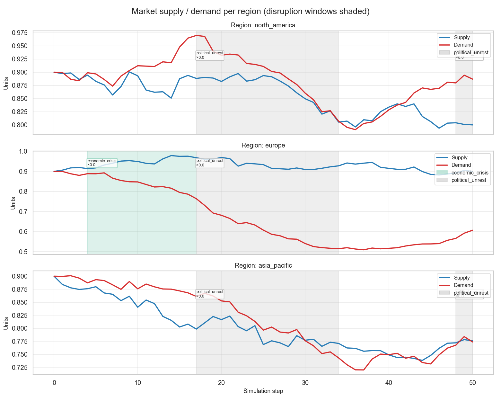
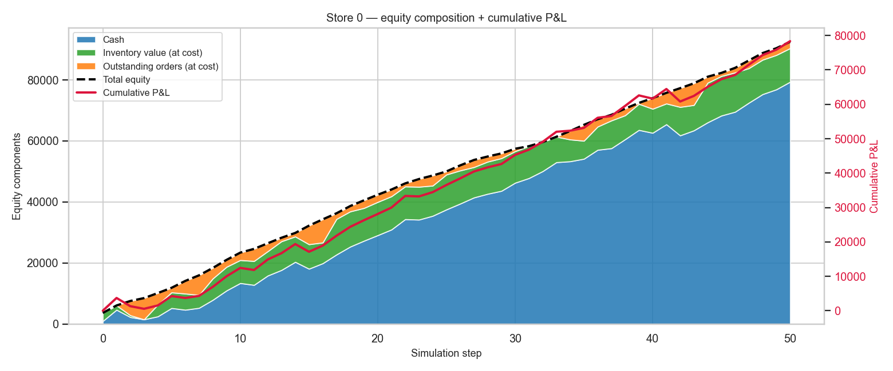
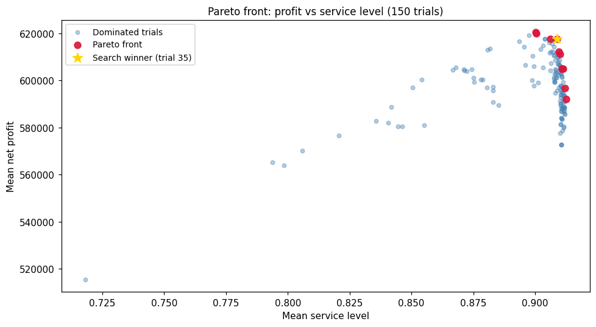
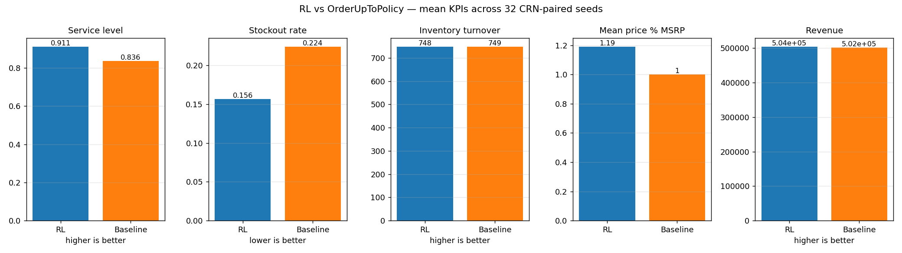

# Supply Chain Simulator

A small, hackable supply-chain simulator. Multiple stores share a single world — regional supply and demand, seasonal cycles, product life-cycles, cross-product correlations, and stochastic disruption events (natural disasters, economic crises, pandemics). Each store runs its own decision policy: it receives an observation every tick (inventory, sales history, prices, market signals) and returns actions (orders, prices, promotions, assortment changes).

The simulator ships with a family of textbook inventory policies — `OrderUpToPolicy` (s,S), `ReorderPointPolicy` (s,Q), and two periodic variants — that double as ready-made baselines for evaluating custom policies. Three add-ons build on top of the simulator: an **LLM world generator** that drafts realistic catalogs and markets from a domain prompt, a **hyperparameter tuner** built on Optuna, and a **PPO reinforcement-learning stack** that trains a continuous-control policy against the textbook baseline using Common Random Numbers.

It is a demo project — the goal is to be readable and easy to extend, not production-grade.



## Quickstart

```bash
uv sync                                                # install
uv run python main.py scenarios/example_homogeneous.py # run a scenario
uv run pytest                                          # tests
```

Outputs land under `data/example_homogeneous/` (parquet + JSON + PNG). The first scenario uses a synthetic catalog and needs no API key; `scenarios/example_llm_world.py` requires `OPENAI_API_KEY` on first run (cached afterwards).

## What's inside

### Simulator and policies (`src/sim/`)

The simulator core. A scenario bundles a product catalog, a market, stochastic disruption events, and a list of stores running their own decision policies. Every tick each store observes (inventory, sales, prices, market signals) and acts (orders, prices, promotions). Custom policies subclass `Policy` and override one method. Four textbook inventory rules ship with the repo — `OrderUpToPolicy` (s,S), `ReorderPointPolicy` (s,Q), and two periodic variants — ready to drop in as baselines.



Full reference: [`src/sim/README.md`](src/sim/README.md) · walkthrough: `notebooks/04a-deep_dive_active_only.ipynb`

### LLM world generator (`src/llm/`)

A pipeline that drafts a coherent world — taxonomy, catalog with prices and seasonality, cross-product correlations, freshness curves, and store templates — from a single domain prompt like `"fashion_retail"` or `"sports_cars"`. Each stage is a schema-validated LLM call; everything else is plain Python. Generated worlds are cached to disk so repeat runs hit no API.

**`sports_cars_100`** — 102 items across 7 categories.

| id | name | category | base | cost | season |
|---|---|---|---:|---:|---|
| P0000 | Apex Vector R8 Track Coupe | Track-Ready Coupes | 128,900 | 91,500 | summer |
| P0024 | Meridian Grand V12 Tourer | Grand Tourers | 168,900 | 121,000 | fall/winter |
| P0042 | Briarwood Convertible GT | Roadsters & Convertibles | 112,400 | 79,700 | spring/summer |
| P0059 | Inferno X Supercar | Exotic Supercars | 315,000 | 224,000 | summer |
| P0073 | Spectra V8 Sport Sedan | Performance Sedans | 82,900 | 58,600 | all_season |

**`fashion_retail_250`** — 336 items across 6 categories.

| id | name | category | base | cost | season |
|---|---|---|---:|---:|---|
| P0000 | Women's Essential Crewneck Tee | Women's Apparel | 24.00 | 8.00 | spring/summer |
| P0086 | Men's Classic Oxford Shirt | Men's Apparel | 54.00 | 20.00 | all_season |
| P0151 | Men's Classic Derby Shoes | Footwear | 98.00 | 38.00 | all_season |
| P0192 | Women's Leather Tote Bag | Accessories | 118.00 | 46.00 | all_season |
| P0241 | Kids' Graphic Tee Pack | Kids' Apparel | 24.00 | 7.50 | spring/summer |

Full reference: [`src/llm/README.md`](src/llm/README.md) · walkthroughs: `notebooks/01-openai_world_builder.ipynb`, `notebooks/02-inspect_world.ipynb`

### Hyperparameter tuning (`src/tuning/`)

An Optuna-based hyperparameter search for any policy. Each trial runs the policy across a fixed set of seeded worlds spanning two orders of magnitude in store size, optimising mean profit per opening dollar. The top winners are re-checked on a separate held-out seed set with bootstrap confidence intervals. All four textbook policies have ready-made search spaces; custom policies need a ~10-line callback.



Full reference: [`src/tuning/README.md`](src/tuning/README.md) · walkthrough: `notebooks/08-tune_textbook_policy.ipynb`

### Reinforcement learning (`src/rl/`)

A PPO training loop on top of a Gymnasium wrapper around the simulator. The agent learns continuous pricing and ordering decisions on a randomised slice of SKUs, and per-episode store size is sampled across two orders of magnitude so one trained policy covers corner-shop to flagship. Evaluation pairs it head-to-head against the textbook baseline on bit-identical worlds — any uplift is the policy, not seed luck.



Full reference: [`src/rl/README.md`](src/rl/README.md) · walkthroughs: `notebooks/05-monitor_rl_training.ipynb`, `notebooks/06-compare_rl_vs_baseline.ipynb`

## Repo layout

```
src/
  sim/         core simulator + textbook policies
  llm/         LLM world generator
  tuning/      Optuna-based hyperparameter search
  rl/          PPO training stack
scenarios/     runnable example scenarios
notebooks/     exploration + analysis notebooks
data/          scenario outputs + cached LLM worlds
runs/          tuning + RL training artifacts
docs/images/   figures used in READMEs
tests/         pytest suite
```

## Further reading

- [CONTEXT.md](CONTEXT.md) — domain and architecture glossary
