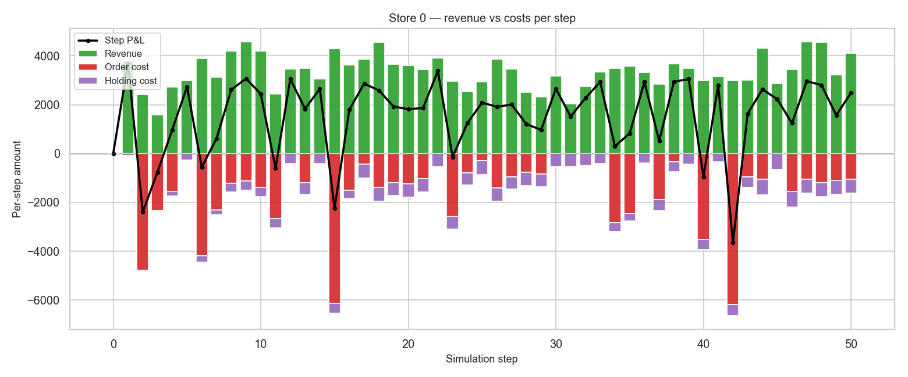
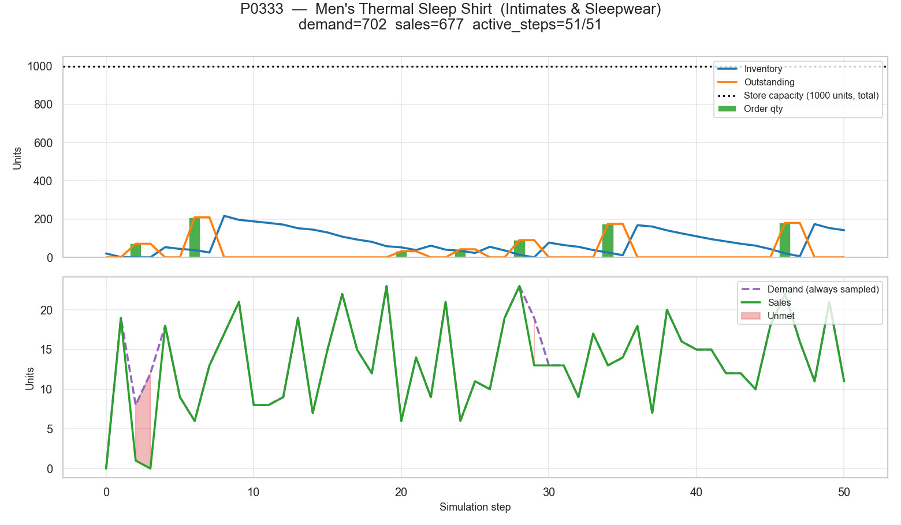

# `src/sim/` — Simulator core

The discrete-event simulator: catalog, market, stores, policies, item life-cycle, freshness curves, and the data exporter that persists run results. Every other sub-package (`src/llm/`, `src/tuning/`, `src/rl/`) builds on top of the primitives defined here.

## Contents

1. [Layout](#layout)
2. [Concepts](#concepts)
3. [Running a scenario](#running-a-scenario)
4. [Authoring a scenario](#authoring-a-scenario)
5. [Output layout](#output-layout)
6. [Policy reference](#policy-reference)
7. [Example scenarios](#example-scenarios)
8. [Common Random Numbers and reproducibility](#common-random-numbers-and-reproducibility)
9. [Visualizing a run](#visualizing-a-run)
10. [Further reading](#further-reading)

## Layout

```
src/sim/
  scenario.py            Scenario dataclass + load_catalog() / make_stores() helpers
  runner.py              Runner + Simulation / build_world / TickResult (two-phase tick API)
  store.py               Store with full accounting (delegates step-0 setup to StoreInitializer)
  store_initializer.py   pure init_store_state seam (bit-identity contract)
  policy.py              Policy ABC + HeuristicPolicy + TextbookReorderPolicy family
  market.py              regional demand/supply (stage × freshness × season × promo × cross)
  event_engine.py        stochastic disruptions + scheduled deliveries
  item_registry.py       catalog + per-item lifecycle/freshness/stock-share state
  lifecycle_clock.py     pure advance_stage() over [introduction, growth, maturity, decline, dead]
  freshness_curve.py     pure m(τ) = 1 + α · exp(−τ / β) multiplier
  distributions.py       Constant / Uniform / Normal / Choice / LogUniform
  metrics.py             RunSlice + aggregate_episode + KPI helpers (shared with tuning + RL)
  episode_sampler.py     EpisodeSpec + sample_episode + default-params factories
  world.py               World dataclass (catalog + market + store_templates) + JSON I/O
  world_loader.py        cache_path → archetype → synthetic fallback resolver
  data_exporter.py       parquet + JSON + PNG writer
```

## Concepts

- **Scenario** — frozen experiment inputs: catalog, market, disruption, item lifecycle, list of `(template, init_seed, policy)` store instances, `n_steps`, `start_date`, `world_seed`.
- **StoreTemplate** — reusable store profile (region, capacity, balance, lead time, fees, …) plus an optional `init_active_products` roster and an `init_freshness` mode (`"baseline"` for established stores, `"fresh"` for grand-opening). The pair `(template, init_seed)` is the bit-identical step-0 contract: two stores built from the same pair start identical regardless of attached policy.
- **Policy** — decision logic attached to a store. Every tick it receives an observation and returns an action dict with keys `order`, `price`, `activate`, `deactivate`, `promotions`. `OrderUpToPolicy` is the textbook (s,S) continuous-review policy used as the CRN comparison anchor for RL; `HeuristicPolicy` is the kitchen-sink demonstrator with 20+ kwargs.
- **Two-layer lifecycle** — every product has a global stage in `[introduction, growth, maturity, decline, dead]` advanced by `LifecycleClock` against the per-stage `stage_change_probs` table; on top of that, every `(store, product)` pair has a freshness curve `m(τ) = 1 + α · exp(−τ / β)` that resets on each `Store.activate_item`. See [ADR 0001](../../docs/adr/0001-two-layer-lifecycle.md) and [ADR 0002](../../docs/adr/0002-per-stage-transitions-and-dead-stage.md).
- **RNG split** — `world_rng` (market, events, item lifecycle), `policy_rng` (policy decisions), and `init_rng` (per-store initial state) never share state. This is what lets policies be compared on identical worlds.
- **DataExporter** — consumes the run log and writes parquet/JSON/PNG under `data/<scenario_stem>/`.

For full domain definitions see [`CONTEXT.md`](../../CONTEXT.md).

## Running a scenario

`main.py` (at the repo root) is a thin CLI: it imports a Python file by path, expects a top-level `scenario` symbol of type `Scenario`, and dispatches to `Runner` and `DataExporter`.

```bash
# Default output: data/<file_stem>/
uv run python main.py scenarios/example_homogeneous.py

# Custom output folder
uv run python main.py scenarios/example_paired_comparison.py --output /tmp/run
```

Each example scenario is also independently runnable:

```bash
uv run python scenarios/example_homogeneous.py
```

Errors `main.py` emits on a bad scenario path:

- `main.py: scenario file not found: <path>` — file does not exist
- `main.py: <path> does not expose a top-level 'scenario' symbol` — module loaded but no `scenario =` at module level
- `main.py: <path>.scenario is <type>, expected Scenario` — wrong type

## Authoring a scenario

A scenario file is a Python module that constructs a `Scenario` and binds it to the name `scenario` at module level.

**1. Catalog.** `load_catalog(items)` accepts a list of dicts and assigns stable `P{i:04d}` ids. Every dict can additionally set per-`Ware` lifecycle / freshness / stock overrides; if omitted, the corresponding default on `ItemLifecycleParams` applies:

```python
from src.sim.scenario import load_catalog

catalog = load_catalog([
    {
        "name": "Widget A",
        "category": "Widgets",
        "related_products": [],
        "base_price": 20.0,
        "unit_cost": 12.0,
        "seasonality": "all_season",
        # Optional per-Ware overrides (any/all may be omitted):
        # "init_stage": "maturity",
        # "stage_change_probs": {"introduction": 0.02, "growth": 0.005,
        #                        "maturity": 0.001, "decline": 0.005, "dead": 0.003},
        # "freshness_alpha": 0.0,        # 0 = staple, no hype curve
        # "freshness_decay": 30.0,
        # "init_stock_share": 2.0,       # weight for initial stock allocation
    },
    {
        "name": "Widget B",
        "category": "Widgets",
        "related_products": [["Widget A", 0.5]],   # cross-product correlation in [0, 1]
        "base_price": 30.0,
        "unit_cost": 18.0,
        "seasonality": "all_season",
    },
])
```

**2. Market, disruption, lifecycle.** Flat dataclasses; stochastic fields hold `Distribution` objects (`Constant`, `Uniform`, `Normal`, `Choice`, `LogUniform`):

```python
from src.sim.distributions import Constant, Normal, Uniform
from src.sim.scenario import DisruptionParams, ItemLifecycleParams, MarketParams

market = MarketParams(
    cycle_len=365,
    cycle_amp=0.1,
    init_demand=100.0,
    init_supply=100.0,
    peak_factor=1.2,
    off_factor=0.7,
    season_months={"all_season": list(range(1, 13))},
    regions=["US"],
    correlation=0.7,
    trend_update_interval=20,
    min_value=20.0,
    max_value=200.0,
    stage_multipliers={"introduction": 0.7, "growth": 1.5, "maturity": 1.0,
                       "decline": 0.2, "dead": 0.05},
    price_elasticity=-1.5,
    promo_multiplier=1.0,
    demand_factor_min=0.1,
    demand_divisor=100.0,
    supply_factor_min=0.01,
    supply_divisor=100.0,
    demand_range=(80.0, 120.0),
    cross_inv_lo=0.3,
    cross_inv_hi=0.7,
    cross_factor_range=(0.3, 1.6),
    trend=Constant(1.0),
    demand_shock=Normal(0.0, 5.0),
    supply_shock=Normal(0.0, 5.0),
    base_demand=Uniform(2, 8),
)

disruption = DisruptionParams(
    event_prob=0.05,
    types=["natural_disaster", "economic_crisis"],
    regions=["US"],
    severity=Constant(1.0),
    duration=Constant(3),
)

_STAGES = ["introduction", "growth", "maturity", "decline", "dead"]
lifecycle = ItemLifecycleParams(
    stages=_STAGES,
    init_stage="maturity",
    # Per-current-stage transition table consumed by LifecycleClock.advance_stage.
    # Set every entry to 0.0 to disable transitions; set "dead" to 0.0 specifically
    # for strict-terminal lifecycle. Per-Ware Ware.stage_change_probs override.
    default_stage_change_probs={s: 0.0 for s in _STAGES},
    # Catalog-wide freshness defaults; per-Ware Ware.freshness_alpha / freshness_decay override.
    # alpha=0 collapses the curve to identically 1 (no hype effect).
    default_freshness_alpha=0.0,
    default_freshness_decay=1.0,
    # Catalog-wide weight for initial-stock allocation across the active set.
    # Per-Ware Ware.init_stock_share overrides; default 1.0 ⇒ even split.
    default_init_stock_share=1.0,
)
```

**3. Store template and policy.** A template is a reusable spec; scalar fields can be replaced with a `Distribution` to randomize across stores at construction time. `init_active_products` (optional) is an explicit roster of product ids to activate at step 0; when omitted, the initializer falls back to `init_rng.sample(catalog, init_active_count)`. `init_freshness` selects between `"baseline"` (initial active SKUs skip the hype window — established store) and `"fresh"` (initial active SKUs start at `τ = 0` — grand-opening).

```python
from src.sim.policy import OrderUpToPolicy
from src.sim.scenario import StoreTemplate

template = StoreTemplate(
    id="standard",
    region="US",
    capacity=200,
    init_balance=10_000.0,
    init_stock_pct=0.4,
    delivery_lag=2,
    holding_rate=0.005,
    order_fee=10.0,
    init_active_count=3,
    # Optional explicit roster — overrides random sampling when set:
    # init_active_products=["P0000", "P0002", "P0004"],
    # Default "baseline" (established store); use "fresh" for grand-opening.
    init_freshness="baseline",
)

# OrderUpToPolicy — textbook (s,S) continuous-review; the CRN comparison anchor.
policy = OrderUpToPolicy(policy_seed=1000)
```

**4. Wire stores together.** One declarative helper, `make_stores(triples)`, covers every case. The triple list *is* the roster — there is no regime abstraction above it:

- **Robustness sweep** (one policy across diverse stores): repeat one policy with varying `init_seed` and/or template.
- **Paired CRN comparison** (two policies on bit-identical world data): repeat the same `(template, init_seed)` with two different policies. Pair `i` lives at indices `2i` and `2i+1`.
- **k-way CRN comparison**: repeat the same `(template, init_seed)` with `k` different policies — same shape, no API change.
- **Mixed roster** (e.g. `A, A, B, C, D` across `T1, T2, T3, T4, T4, T4`): just write the literal triple list.

**5. Final assembly.** Bind to `scenario`:

```python
from datetime import datetime
from src.sim.scenario import Scenario, make_stores

scenario = Scenario(
    catalog=catalog,
    market=market,
    disruption=disruption,
    item_lifecycle=lifecycle,
    stores=make_stores([
        (template, 1, policy),
        (template, 2, policy),
        (template, 3, policy),
    ]),
    n_steps=50,
    start_date=datetime(2024, 1, 1),
    world_seed=42,
)
```

Save under `scenarios/my_run.py` and run `uv run python main.py scenarios/my_run.py`.

## Output layout

Every run produces (relative to `--output`, default `data/<stem>/`):

```
data/<stem>/
  config/
    scenario.json            full Scenario.to_json() (policies excluded — they are Python objects)
  data/
    run_log.json             per-step log with ISO-formatted datetimes
    products.parquet         static catalog (product_id, name, category, prices, seasonality)
    stores.parquet           static store metadata (template_id, region, init_seed, policy_type)
    timeseries.parquet       per-step × per-store × per-product metrics
  reports/
    overview.png             regional supply/demand chart
```

`timeseries.parquet` columns: `simulation_step`, `simulation_date`, `store_id`, `product_id`, `inventory`, `demand`, `sales`, `order_quantity`, `outstanding_orders`, `promotion_status`, `active_status`, `price`, `revenue`, `total_cost`, `holding_cost`, `profit`.

## Policy reference

### Writing a custom policy

Subclass `Policy` and implement `decide(observation) -> action_dict`:

```python
from collections.abc import Mapping
from typing import Any

from src.sim.policy import Policy


class MyPolicy(Policy):
    def decide(self, observation: Mapping[str, Any]) -> dict[str, Any]:
        # Read what the store sees this tick:
        #   observation["inventory"]          dict[pid, int]
        #   observation["outstanding_orders"] dict[pid, int]
        #   observation["active_products"]    iterable of pid
        #   observation["product_prices"]     dict[pid, float] — last-tick realised prices
        #   observation["base_prices"]        dict[pid, float] — immutable MSRP
        #   observation["unit_costs"]         dict[pid, float]
        #   observation["sales"]              dict[pid, int]  — units sold this tick
        #   observation["balance"]            float
        #   observation["max_capacity"]       int | float
        #   observation["current_sim_step"]   int
        #   observation["related_products"]   dict[pid, list[(pid, float)]]
        #   observation["promotions"]         dict[pid, dict]
        return {
            "order":       {pid: 0 for pid in observation["active_products"]},
            "price":       observation["base_prices"],   # flat MSRP
            "activate":    [],
            "deactivate":  [],
            "promotions":  {},
        }
```

All stochastic choices should consume `self.policy_rng` (seeded from the `policy_seed` kwarg on the base class) so policy decisions never perturb the world stream.

### `HeuristicPolicy`

20-knob kitchen-sink demonstrator with dynamic pricing, promotions, slow-mover deactivation, and periodic catalog review. Kept for `scenarios/example_*` parameter-demo purposes.

| kwarg | default | meaning |
| --- | --- | --- |
| `policy_seed` | `None` | seed for `policy_rng`; one stream per instance |
| `min_qty` | 10 | allocator floor — anything below is rounded to 0 |
| `init_qty_factor` | 0.3 | multiplier on free-space when sizing the first order after activation |
| `promo_len` | 5 | promo duration in ticks (scalar or `Distribution`) |
| `promo_cd_len` | 10 | cooldown applied after a promo expires |
| `review_interval` | 5 | period in ticks for the catalog-review pass |
| `promo_threshold` | 0.7 | stock-ratio above which a product becomes a promo candidate |
| `target_active_count` | 10 | target active-SKU count for the review pass |
| `active_margin` | 2 | tolerance band around `target_active_count` |
| `max_activations_per_review` | `None` | cap on activations per review pass |
| `slow_sales_limit` | 5 | "no movement in window" deactivation threshold |
| `stock_lo_ratio` / `stock_hi_ratio` | 0.2 / 0.6 | stock-ratio band for dynamic pricing |
| `price_up_factor` / `price_down_factor` | 1.1 / 0.9 | pricing factors when stock/trend signals fire |
| `history_window` | 10 | rolling window for sales-trend computation |
| `slow_mover_lookback_factor` | 6 | extended-lookback multiplier on `history_window` |
| `trend_threshold` | 0.05 | trend magnitude threshold for triggering price moves |
| `cross_price_adj` | 0.05 | per-related-product price-adjustment magnitude |
| `max_history` | 100 | bounded per-product history length |
| `inactive_price_factor` | 0.5 | clearance multiplier for inactive products |
| `reorder_factor` | 0.3 | stock-position threshold for reorders |
| `qty_factor` | 0.5 | target stock-fill factor for periodic reorders |
| `order_cd_len` | 10 | per-product order-cooldown length |
| `order_cd_jitter` | 0.3 | jitter on the order cooldown |
| `promo_discount` | 0.7 | discount applied during promotions (scalar or `Distribution`) |

### `TextbookReorderPolicy` family

Four textbook inventory rules sharing one base class with a censored-sales rate estimator, a two-pass fair-share allocator across the capacity and cash pools, and a cash-budget "pilot order" cold-start. All four emit `activate=[]`, `deactivate=[]`, `promotions={}`, and `price[pid] = base_price[pid]` — pure inventory policies with exogenous pricing. See [ADR 0006](../../docs/adr/0006-textbook-reorder-policy-family.md) and [ADR 0008](../../docs/adr/0008-safety-horizons-as-fraction-of-delivery-lag.md).

Shared base-class kwargs:

| kwarg | default | meaning |
| --- | --- | --- |
| `policy_seed` | `None` | seed for `policy_rng` |
| `cover_horizon_ticks` | 14 | cycle length: drives `S − s` for order-up-to. Independent of lead time (EOQ result). |
| `safety_lead_pct_of_lag` | 1/3 | fraction of per-pid delivery lag used as effective safety horizon. `s = (lag + safety_lead_pct_of_lag × lag) × rate` |
| `opening_budget_pct` | 0.50 | fraction of opening cash spent on the very first order, split across the K active SKUs |
| `stockout_safety_bonus_pct_of_lag` | 0.0 | opt-in adaptive bonus added to the safety horizon when the recent window contains stockouts |
| `min_qty` | 0 | allocator floor on non-pilot orders (textbook-pure default = 0) |

The four concrete variants:

| class | rule | extra kwarg | notes |
| --- | --- | --- | --- |
| `OrderUpToPolicy` | (s,S) continuous review | — | the **CRN comparison anchor** for RL |
| `ReorderPointPolicy` | (s,Q) continuous review | `Q` (default rate-derived from `cover_horizon_ticks`) | fixed-order-quantity variant |
| `PeriodicOrderUpToPolicy` | (R,S) periodic review | `review_interval` (ticks) | order-up-to with a calendar trigger |
| `PeriodicReorderPolicy` | (R,s,S) periodic review | `review_interval` (ticks) | (s,S) gated by a calendar trigger |

## Example scenarios

**`scenarios/example_homogeneous.py`** — three stores, one shared `HeuristicPolicy`, distinct `init_seed`s. The right starting point for population-level evaluation of a single policy.

```bash
uv run python main.py scenarios/example_homogeneous.py
```

**`scenarios/example_paired_comparison.py`** — two pairs (4 stores) running an aggressive vs. conservative `HeuristicPolicy` on bit-identical world data. Aggressive promotes earlier with bigger markdowns (`promo_threshold=0.30`, `promo_discount=0.6`); conservative promotes only on heavy stock with gentler markdowns (`promo_threshold=0.70`, `promo_discount=0.85`). The right starting point for a variance-reduced policy A/B test.

```bash
uv run python main.py scenarios/example_paired_comparison.py
```

**`scenarios/example_llm_world.py`** — 12-item fashion-retail world built by the LLM, three stores. First run needs `OPENAI_API_KEY` and caches the world to `data/worlds/fashion_retail_12/world.json`; subsequent runs load locally.

```bash
OPENAI_API_KEY=... uv run python main.py scenarios/example_llm_world.py
```

**`scenarios/example_llm_world_offline.py`** — the same pipeline driven by a `CannedClient` that pops pre-built Pydantic payloads. Useful for inspecting payload shapes and running deterministically with no API key.

```bash
uv run python main.py scenarios/example_llm_world_offline.py
```

**`scenarios/llm_world_20.py`**, **`scenarios/llm_world_100.py`**, **`scenarios/llm_world_250.py`**, **`scenarios/llm_world_1000.py`** — larger LLM-built worlds (20, 100, 250, and 1000 items). Same cache + consent model as `example_llm_world.py`; the 1000-item scenario also rescales the LLM-authored template for the larger catalog.

## Common Random Numbers and reproducibility

Three independent random streams, three independent seeds:

| Seed | Stream | Used for |
|---|---|---|
| `Scenario.world_seed` | `world_rng` | market dynamics, disruption events, item lifecycle transitions |
| `Policy.policy_seed` | `policy_rng` | policy decisions only (one stream per policy instance) |
| `StoreInstance.init_seed` | `init_rng` | step-0 SKU activation and stock allocation |

Consequences:

- Replaying the same `Scenario` produces the same world trajectory.
- Two stores constructed from the same `(template, init_seed)` pair start step 0 bit-identical — the integration tests assert this on the paired-comparison example.
- Swapping a policy on a scenario does not perturb the world stream, so per-policy outcome differences come from policy decisions alone.

See [ADR 0003](../../docs/adr/0003-crn-demand-for-all-products.md) for the CRN demand-sampling guarantee that makes this property hold within a single run.

## Visualizing a run

`notebooks/04a-deep_dive_active_only.ipynb` is a single-store deep-dive over a run's parquet + run-log artifacts: world view, store financials, decision summary, and per-product cards over the active SKUs. The four headline panels below are rendered from `data/llm_world_250/` (one store, 51-tick run over a 250-item LLM-built fashion-retail world, `OrderUpToPolicy`) — re-runnable via `uv run python scripts/render_readme_simulator_images.py`.

**Market supply / demand per region.** The market dynamics every store sees, with disruption windows shaded by event type. This is the world stream that is held fixed across paired-CRN comparisons.


**Equity composition + cumulative P&L.** Stacked equity (cash + inventory at cost + outstanding orders at cost) on the left axis; cumulative P&L on the right. The dashed equity line equals the stack height — re-arranged so the components are legible.


**Revenue vs cost per step.** Per-tick revenue (above zero) decomposed against order cost and holding cost (below zero); the black line is realised step P&L. Order-cost spikes line up with order-quantity bars in the per-product card below.



**Per-product card — `P0333` (Men's Thermal Sleep Shirt).** Top panel: on-hand inventory, outstanding orders, and order-quantity bars against the store's total capacity. Bottom panel: sampled demand vs realised sales; the red band is unmet demand (a stockout). Demand is sampled on every step regardless of active status, so the panel surfaces latent demand on inactive windows too.



## Further reading

- [`CONTEXT.md`](../../CONTEXT.md) — domain and architecture glossary
- [ADR 0001](../../docs/adr/0001-two-layer-lifecycle.md) — Lifecycle is two-layer: global PLC × per-store freshness curve
- [ADR 0002](../../docs/adr/0002-per-stage-transitions-and-dead-stage.md) — Per-stage transition probabilities and a `dead` stage
- [ADR 0003](../../docs/adr/0003-crn-demand-for-all-products.md) — Demand is sampled for every catalog product each tick (CRN cleanliness)
- [ADR 0006](../../docs/adr/0006-textbook-reorder-policy-family.md) — Textbook reorder-policy family as the RL comparison anchor
- [ADR 0008](../../docs/adr/0008-safety-horizons-as-fraction-of-delivery-lag.md) — Safety horizons as fractions of delivery lag
- [ADR 0010](../../docs/adr/0010-sim-as-base-for-ml-layers.md) — `src/sim/` as the canonical home for rollout primitives
