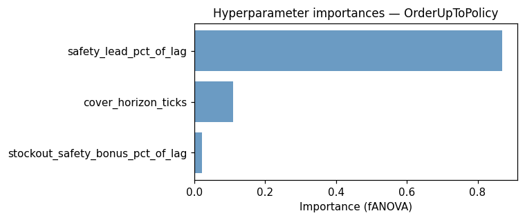
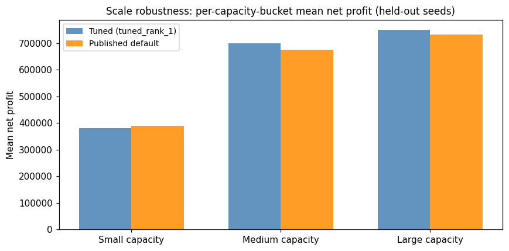

# `src/tuning/` — Policy hyperparameter tuning

An Optuna-based hyperparameter tuner for any `Policy` subclass. It frames tuning as a measurement instrument — *how much profit headroom exists above the published textbook defaults?* — rather than per-world baseline construction. Trials run the policy on a fixed CRN seed set with log-uniform domain randomisation across capacity and balance; the objective is mean `net_profit / initial_cash` (dimensionless, scale-comparable across two orders of magnitude of store size).

## Contents

1. [Layout](#layout)
2. [Quickstart](#quickstart)
3. [Output layout](#output-layout)
4. [Programmatic use](#programmatic-use)
5. [Analysis notebook](#analysis-notebook)
6. [CRN guarantee](#crn-guarantee)
7. [CLI flags](#cli-flags)

## Layout

```
src/tuning/
  config.py         TuningConfig — every knob the study reads (n_trials, seed offsets,
                    distributions, world archetype)
  episode.py        Config-adapter — unpacks TuningConfig and calls src/sim/episode_sampler.sample_episode
  world_loader.py   Config-adapter — unpacks TuningConfig and calls src/sim/world_loader.load_world
  rollout.py        run_policy_episode(policy, spec) — one episode on the graph engine
                    (factory(s) → IntermediateNode "S" → sink-per-product) via build_world + Simulation.tick
  evaluator.py      evaluate_policy_normalised(factory, specs) — single-policy CRN evaluator
  search_spaces.py  bundled trial-callback factories: order_up_to_space, reorder_point_space,
                    periodic_order_up_to_space, periodic_reorder_space
  study.py          run_study(...) + confirm_top_k(...) + `python -m src.tuning.study` CLI
```

Custom policies write their own ~10-line trial-callback factory (`f(trial) -> Policy`) and pass it to `run_study`; the four bundled factories cover the textbook variants.

The tuner runs on the **multi-echelon graph engine**: each trial builds a degenerate `factory → IntermediateNode("S") → sink-per-product` graph from the resolved `base_template` and attaches the candidate `MultiSupplierTextbookPolicy` to node `S`. The four bundled search spaces tune the shared textbook knobs plus two routing tunables introduced with the migration — `per_supplier_min_order_floor` (int `[0, 10]`, the buyer-side min order per line) and `routing_strategy` (categorical: `cheapest_first` / `fill_rate_weighted`) — alongside each variant's own parameters (`Q`, `review_interval`, …). They surface as extra columns in `trials.parquet`.

## Quickstart

Run a 150-trial study against the canonical fashion-retail world, then re-evaluate the top-5 winners on a disjoint 32-seed held-out set:

```bash
uv run python -m src.tuning.study \
  --policy order_up_to \
  --trials 150 \
  --study-name order_up_to_v1
```

Each trial evaluates on 16 CRN seeds (default; `--n-search-seeds`) at 365-tick episodes (`--episode-length`); world cache resolved via `--world` (default `fashion_retail_250` → `data/worlds/fashion_retail_250/world.json`). Sequential runtime is ~40–80 min on a laptop. To skip the holdout phase, pass `--skip-holdout`. All flags:

```bash
uv run python -m src.tuning.study --help
```

## Output layout

Artifacts land under `runs/tuning/<study-name>/`:

```
runs/tuning/<study-name>/
  trials.parquet         one row per trial: kpis + sampled params
  per_seed.parquet       long format: one row per (trial, seed) with per-seed KPIs
  study.json             study metadata + search-space spec + best trial + git SHA
  holdout.parquet        top-K winners + published default re-evaluated on holdout seeds
  holdout_summary.json   bootstrap CIs + headline paired uplift (tuned − default)
```

`trials.parquet` columns: `trial_id`, `state`, `datetime_start`, `datetime_complete`, `duration_s`, `mean_normalised_return`, `mean_net_profit`, `mean_service_level`, `mean_stockout_rate`, `mean_inventory_turnover`, `mean_revenue`, `mean_mean_price_pct_of_msrp`, plus one column per sampled hyperparameter.

`per_seed.parquet` columns: `trial_id`, `seed`, `capacity`, `initial_cash`, `net_profit`, `normalised_return`, `service_level`, `stockout_rate`, `inventory_turnover`, `revenue`, `mean_price_pct_of_msrp`.

The Parquet files load with just `pandas` + `pyarrow` — no Optuna import needed at read time.

## Programmatic use

`run_study` returns the in-memory `optuna.Study`; the API is also accessible directly:

```python
from src.tuning import (
    TuningConfig,
    order_up_to_space,
    run_study,
    confirm_top_k,
    load_world,
)

config = TuningConfig(n_trials=150, n_search_seeds=16)
catalog, base_template, market_params, disruption_params = load_world(config)

study = run_study(
    order_up_to_space,
    catalog=catalog,
    base_template=base_template,
    tuning_config=config,
    study_name="order_up_to_v1",
    market_params=market_params,
    disruption_params=disruption_params,
)

summary = confirm_top_k(
    study,
    order_up_to_space,
    catalog=catalog,
    base_template=base_template,
    tuning_config=config,
    study_dir="runs/tuning/order_up_to_v1",
    market_params=market_params,
    disruption_params=disruption_params,
)

print(summary["headline_uplift"])  # paired (tuned − default) on holdout
```

For a tiny smoke run that doesn't need a world cache:

```python
demo = TuningConfig(n_trials=10, n_search_seeds=4, episode_length=60)
catalog, base_template, _, _ = load_world(demo)  # synthetic fallback when cache missing
study = run_study(order_up_to_space, catalog=catalog, base_template=base_template,
                  tuning_config=demo, study_name="demo", output_dir="/tmp/demo_tuning")
```

## Analysis notebook

`notebooks/08-tune_textbook_policy.ipynb` walks through a finished study: optimisation trajectory, tuned-vs-default headline with bootstrap CIs, parameter-sensitivity scatters, fANOVA importances, Pareto front (profit vs service level), and per-capacity-bucket robustness. It loads `runs/tuning/order_up_to_v1/` and runs an additional 10-trial live demo against `/tmp/demo_tuning/` so the API is exercised end-to-end without re-running the full study.

Headline outputs from a 150-trial study against the `fashion_retail_250` world:

**Pareto front — profit vs service level.** Each dot is one trial; red dots are non-dominated; the gold star is the search winner.


**Hyperparameter importance (fANOVA).** `safety_lead_pct_of_lag` dominates; `cover_horizon_ticks` is secondary; `stockout_safety_bonus_pct_of_lag` is near-noise.



**Scale robustness — per-capacity-bucket mean net profit.** Tuned vs published default on the 32 held-out seeds, bucketed into small / medium / large by sampled capacity.



## CRN guarantee

Every trial in a study evaluates on the same eval-specs list, built once before `study.optimize` is called and closed over by the trial objective. Two trials sampling identical kwargs on identical seeds therefore produce bit-identical trajectories — differences between trials are attributable to the policy kwargs alone, exactly the property `eval/paired_uplift` provides for RL. The per-trial CRN tuple includes the graph engine's `allocation` sub-seed (ADR 0016) so the deterministic per-phase buyer shuffle is held fixed across trials too. The search seeds (`seed_offset = 12_000_000`) and holdout seeds (`holdout_seed_offset = 13_000_000`) are disjoint from each other and from the RL training and eval ranges.

## CLI flags

| Flag | Default | Meaning |
| --- | --- | --- |
| `--policy` | required | One of `order_up_to`, `reorder_point`, `periodic_order_up_to`, `periodic_reorder` |
| `--study-name` | required | Output sub-directory under `--output-dir` |
| `--trials` | 150 | Number of Optuna trials |
| `--n-search-seeds` | 16 | CRN seeds for the search phase |
| `--n-holdout-seeds` | 32 | CRN seeds for the holdout phase |
| `--seed-offset` | 12_000_000 | First search-phase seed |
| `--sampler-seed` | 42 | Optuna sampler seed |
| `--top-k` | 5 | Number of top trials re-evaluated on holdout |
| `--episode-length` | 365 | Ticks per episode (one calendar year) |
| `--world` | fashion_retail_250 | World archetype; resolved against `data/worlds/<archetype>/world.json` |
| `--output-dir` | runs/tuning | Root output directory |
| `--skip-holdout` | off | Write only the three search artifacts; skip `confirm_top_k` |
